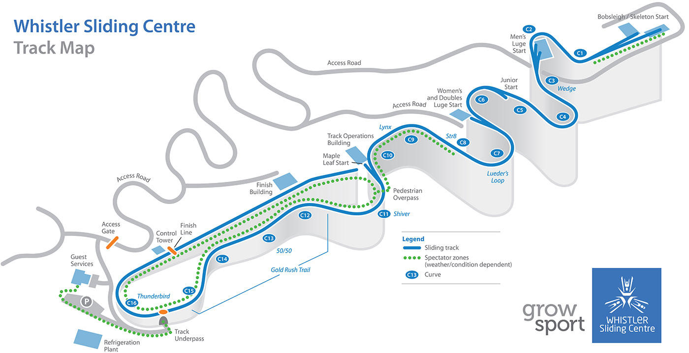

# Physics Mechanics Model

For our Physics 1 course in _Introductory Mechanics_ at Quest University, we were tasked with learning about Newtonian Mechanics and completed a month-long project to build a physics model that would convert acceleration data obtained from a smartphone app, into velocity, and position data.

## Modelling Lift Motion

Since very few of us had coding experience and none had python experience, we first started with the simple task of modelling a lift. As this was a one-dimensional problem (the elevator only moved vertically), this was a good introduction to coding on python independently and to the numerical solutions to the physics involved. The data were compared with the measurements from a much more precise and accurate instrument using LoggerPro. The results from LoggerPro and the phone are shown in order below:

	

		
	

	
&nbsp;&nbsp;

	

		
	

We can see that the velocity calculated from the recordings of the phone's accelerometer (and as a result the position data) did not match the LoggerPros data as the velocity drifted over time such that the final velocity was not the expected value of 0 m/s. Therefore, this was corrected assuming the "drift" was linear to give us the following results (in the same units as above), which are match the LoggerPro results much better.

## Modelling Trampoline Jumps

Our next task was to use our phone's accelerometer to find the same information for a set of trampoline jumps. Since the phone was held by a human (me), this introduced three-dimensionality to the measurements as there was no way the phone was held vertically throughout a trampoline jump. The idea used to correct for this was to use the rotation rates recorded by the phone and to use rotation matrices to find the vertical component of the acceleration. Moreover, as I knew from the previous experiment that there was a need to calibrate for velocity, I made sure to begin and end the experiment only when I reached a complete stop on the trampoline. This was especially true for this experiment since the sharp changes in acceleration from the trampoline translated into large errors. Nonetheless, upon correcting the "drift" for velocity, we still saw that the position did not end at 0 m. I therefore also attempted to correct for that. Below are the results with the left having only velocity corrected and the right having velocity and then position corrected.

	

		
	

	
&nbsp;&nbsp;

	

		
	

As we can see, neither of these are completely real. The figure on the left showed separate jumps whose highest points were lower than my starting position, and the figure on the right showed separate jumps that whose lowest points were higher than my starting position. Nonetheless, this seems like the best result with the available data.

## Modelling Skeleton Runs

Finally, our task was to model a single run of the winter sport known as skeleton. We collected the data ourselves at the Whistler Sliding Centre. Again, I made sure I began data collection with a velocity of 0 m/s, however, due to the icy surface, it was impossible to make sure my velocity in the non-vertical directions 0. Therefore, the only velocity correction made was in the vertical (y) direction. Moreover, as this was a completely three-dimensional problem (in the input and output) with a non-inertial frame of reference, it was necessary to apply the rotation matrices to get a 3D acceleration vector in an inertial reference frame.

The output position vector was then used to output an animation of the skeleton run over time including a trail to show the skeleton track. Even with these corrections, the output did not match real-world conditions. However, I recalled from our safety briefing at Whistler that the expected maximum acceleration was 3g. Therefore, I decided to try out some noise correction by collapsing all acceleration greater than 3g to exactly 3g. This insight proved to work beautifully. For comparison, below is an official map of Whistler sliding centre; as civilians with no training, we were only allowed to complete the track starting from the Maple Leaf Start (around C10).

<figure>
	
	<figcaption><a href="https://www.bobsleighcanadaskeleton.ca/en/about/sports/whistler/">Source</a></figcaption>
</figure>

And here is the output from my own data.

<video width="520" autoplay muted loop controls>
	<source src="../assets/projects/physics-model/skeleton-run.mp4" type="video/mp4">
</video>

Due to my _in situ_ and _a posteriori_ corrections, and by drawing from my knowledge of linear algebra, to-date I am the only student who was able to accurately model the physics of a skeleton run. Below are the output data for the skeleton run.

